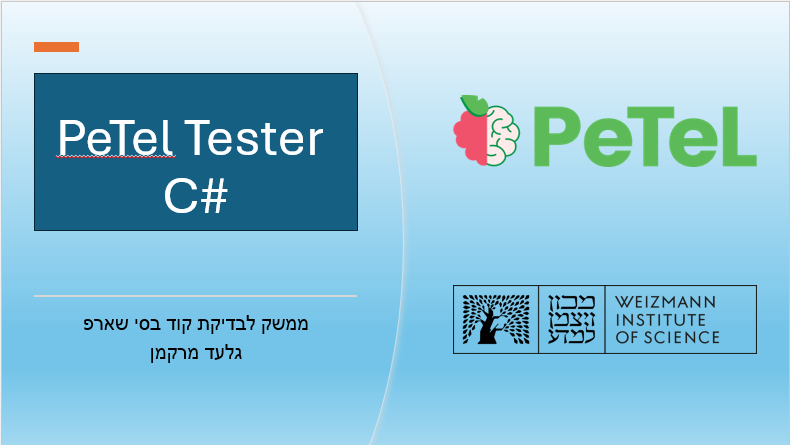
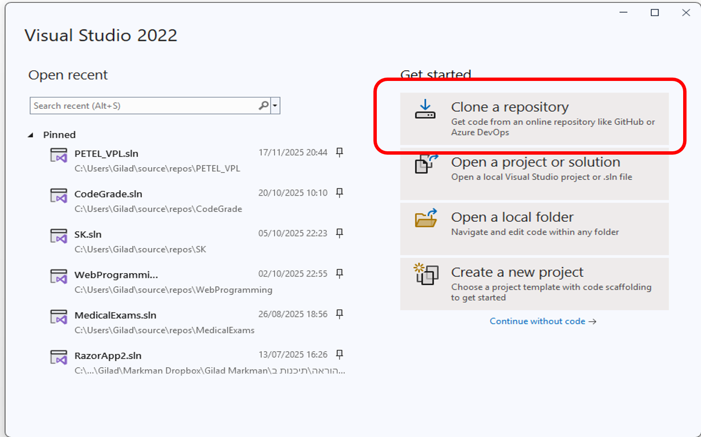
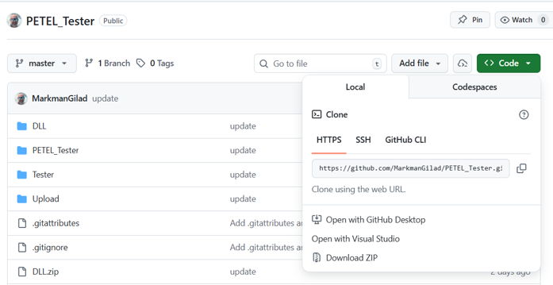

<p align="center">
      
</p>


# ממשק לבדיקת קוד - PeTel Tester C#

**מכון ויצמן למדע | PeTel**

מדריך זה מסביר כיצד להשתמש בממשק בדיקת הקוד (Tester) בשפת C# המיועד עבור סביבת **PeTel** (המבוססת על Moodle VPL). הממשק מאפשר למורים ליצור מטלות תכנות, להריץ בדיקות פונקציונליות (Case Tests) ובדיקות מבניות (Code Tests) על פתרונות תלמידים בצורה אוטומטית.

## תוכן עניינים
1. [כללי](#כללי)
2. [הכנת סביבת הפיתוח](#הכנת-סביבת-הפיתוח)
3. [הורדת והתקנת הממשק](#הורדת-והתקנת-הממשק)
4. [יצירת משימה חדשה](#יצירת-משימה-חדשה)
5. [בניית Tester - קבצי בסיס](#בניית-tester---קבצי-בסיס)
6. [עבודה עם Unit4Helper](#עבודה-עם-unit4helper)
7. [בניית בדיקות פונקציונליות (Case Tester)](#בניית-בדיקות-פונקציונליות-case-tester)
8. [בניית בדיקות מבנה ותחביר (Code Tester)](#בניית-בדיקות-מבנה-ותחביר-code-tester)
9. [העלאת הבדיקה ל-PeTel VPL](#העלאת-הבדיקה-ל-petel-vpl)

---

## כללי

ממשק בדיקת הקוד מורכב משלושה חלקים עיקריים:
1. **בדיקה פונקציונאלית**-**Case Tester**: בדיקה של תוצאות הרצת קוד התלמיד (Output/Return Value) בהשוואה לפתרון המורה.
2. **בדיקה תחבירית**-**Code Tester**: בדיקה של תחביר ומבנה הקוד (האם הפונקציה רקורסיבית? האם היא סטטית? האם יש לולאות מקוננות?).
3. **בדיקת בינה מלאכותית**-**AI Tester**: (בפיתוח) בדיקת קוד באמצעות מודל בינה מלאכותית.

תהליך העבודה כולל פיתוח הבדיקות בסביבת **Visual Studio**, הרצת בדיקות מקומיות על פתרונות אפשריים, ולבסוף העלאת הקבצים לסביבת PeTel.

---

## הכנת סביבת הפיתוח

סביבת הפיתוח הנדרשת היא **Visual Studio** (גרסת Community החינמית מספיקה).

### שלבי התקנה ודרישות:
1. בעת התקנת Visual Studio, יש לוודא שה-Workload בשם **NET desktop development.** מסומן.
2. יש לוודא שרכיב **NET Framework 4.7.2.** מותקן (אם חסר, יש להתקינו דרך ה-Installer בלשונית Individual Components).

<p align="center">
   
</p>
---

## הורדת והתקנת הממשק

הממשק זמין כפרויקט פתוח ב-GitHub. ניתן להוריד אותו באחת משתי דרכים:

1. **Cloning**: שכפול הפרויקט באמצעות Git.
2. **Download ZIP**: הורדת קובץ ZIP ופתיחתו במחשב.

**כתובת המאגר:** `https://github.com/MarkmanGilad/PETEL_Tester`

### אפשרות 1: Cloning דרך Visual Studio
במסך הפתיחה בחר ב-**Clone a repository**, הזן את הכתובת הנ"ל ולחץ על **Clone**.
<p align="center">

</p>

### אפשרות 2: הורדת ZIP
באתר GitHub, לחץ על כפתור **Code** ובחר **Download ZIP**. לאחר ההורדה, חלץ את הקבצים (Extract) ופתח את הקובץ `PETEL_Tester.slnx`.

<p align="center">

</p>
---

## יצירת משימה חדשה

כדי ליצור בדיקה למטלה חדשה, אנו יוצרים פרויקט חדש בתוך ה-Solution הקיים.

### שלב 1: יצירת פרויקט
1. בחלון Solution Explorer, לחץ קליק ימני על ה-Solution.
2. בחר **Add -> New Project**.
3. בחר בסוג פרויקט: **Console App (.NET Framework)** בשפת **C#**.
4. תן שם לפרויקט (לדוגמה: `CopyQueue`) וודא שה-Framework הוא **4.7.2**.

<p align="center">
   
      
      
</p>


### שלב 2: התקנת ספריות (NuGet)
1. לחץ קליק ימני על ה-Solution ובחר **Manage NuGet Packages for Solution**.
2. עבור ללשונית **Installed**.
3. אתר את הספרייה **Microsoft.CodeAnalysis.CSharp**.
4. סמן את הפרויקט החדש שיצרת.
5. **חשוב מאוד:** וודא שהגרסה המותקנת היא **4.10.0**. **אין לעדכן לגרסה חדשה יותר**. לחץ על Install.

<p align="center">
   
      
</p>


### שלב 3: העתקת קבצי המערכת
יש להעתיק לפרויקט החדש את קבצי הליבה של הטסטר מתוך התיקייה `PETEL_Tester` המקורית.
1. קליק ימני על הפרויקט החדש -> **Add -> Existing Item**.
2. נווט לתיקיית `PETEL_Tester/PETEL_Tester`.
3. סמן והוסף את כל הקבצים **למעט** `Program.cs`. הקבצים הנדרשים כוללים את:
    * `CodeAnalyzer.cs`
    * `MainTester.cs`
    * `ObjectCloning.cs`
    * `ObjectComparer.cs`
    * `StudentAnswer.cs`
    * `TeacherAnswer.cs`
    * `Unit4.cs`
    * `VPLTester.cs`

<p align="center">
   
      
</p>


### שלב 4: הגדרת נקודת כניסה (Entry Point)
1. קליק ימני על הפרויקט החדש -> **Properties**.
2. שנה את ה-**Startup Object** ל-`PETEL_VPL.MainTester`.
3. שמור את השינויים (Ctrl+S).

כעת הפרויקט מוכן לפיתוח המשימה. ניתן להריץ (Ctrl+F5) כדי לראות פלט ברירת מחדל.

---

## בניית Tester - קבצי בסיס

תהליך בניית הבדיקה דורש עריכה של שלושה קבצים מרכזיים בפרויקט שיצרנו:

1. **TeacherAnswer.cs**: קובץ המכיל את הפתרון הנכון (של המורה). משמש כבסיס להשוואה ("האמת").
2. **StudentAnswer.cs**: קובץ המדמה פתרון של תלמיד. נשתמש בו כדי לבדוק שהטסטר שלנו מזהה שגיאות נכון (למשל, נכתוב בו פתרון שגוי בכוונה).
3. **MainTester.cs**: קובץ המנהל את הבדיקות (יוסבר בהרחבה בהמשך).


---

## עבודה עם Unit4Helper

הממשק כולל מחלקה בשם `Unit4Helper` המאפשרת יצירה והדפסה קלה של מבני נתונים (רשימות, תורים, מחסניות ועצים) לצורך כתיבת הבדיקות.

### פעולות נפוצות:
* **יצירת רשימה/תור/מחסנית:** `Unit4Helper.BuildQueue(new int[] {1, 2, 3})`.
* **הדפסה:** `Console.WriteLine(q)` (המתודות `ToString` ממומשות להדפסה נוחה).
* **עצים בינאריים:** ניתן לטעון עץ מקובץ טקסט המייצג את המבנה בהזחות (Tabs).
  ```csharp
  // דוגמה לטעינת עץ
  string path = Unit4Helper.GetTreeFilePath("tree.txt");
  BinNode<int> tree = Unit4Helper.BuildBinaryTree<int>(path);
  Unit4Helper.PrintBinaryTree(tree); // הדפסה ויזואלית לקונסול
  ```


---

## בניית בדיקות פונקציונליות (Case Tester)

הקובץ `MainTester.cs` הוא הלב של מערכת הבדיקות. עלינו להגדיר את הפונקציה `CaseTester` שמבצעת את הבדיקות בפועל.

### אתחול (Main)
בפונקציה `Main`, אנו יוצרים מופע של `VPLTester` ומגדירים את שמות הקבצים והמחלקות:

```csharp
var tester = new VPLTester(
    studentFile: "StudentAnswer.cs",
    studentClassName: "StudentAnswer",
    studentMethodName: "countRemoveItem", // שם הפעולה הנבדקת אצל התלמיד
    teacherNamespace: "PETEL_VPL",
    teacherClassName: "TeacherAnswer",
    teacherMethodName: "countRemoveItem", // שם הפעולה הנבדקת אצל המורה
    showDetails: true
);
```

### הגדרת בדיקה (TestMethod)
הפונקציה `tester.TestMethod` מגדירה מקרה בדיקה בודד. להלן הפרמטרים העיקריים:

| פרמטר | סוג | תיאור |
| :--- | :--- | :--- |
| **testName** | `string` | שם הבדיקה והסבר קצר שיוצג לתלמיד. |
| **points** | `int` | ניקוד שיינתן במידה והבדיקה עברה. |
| **parameters** | `object[]` | מערך הפרמטרים שיישלחו לפונקציה הנבדקת. |
| **compareParams** | `bool` | האם לבדוק שינויים בפרמטרים המקוריים (Side Effects)? (ברירת מחדל: `true`). |
| **compareReturn** | `bool` | האם לבדוק את ערך ההחזרה? (ברירת מחדל: `true`). |
| **consoleInput** | `object` | קלט למסוף (אם הפונקציה מבקשת קלט מהמשתמש). |
| **captureConsoleOutput** | `bool` | האם להשוות את הפלט שהודפס למסוף (Console.WriteLine)? |
| **exceptionComments** | `Dictionary` | מילון הממיר שגיאות (Exceptions) להודעות מותאמות אישית. |

#### דוגמה לבדיקה המודאת שהתלמיד לא הרס את התור המקורי:
```csharp
Queue<int> q3 = Unit4Helper.BuildQueue(new int[] { 1, 4, 4 });
tester.TestMethod(
    testName: "Test 3: check if student changed the original queue",
    points: 10,
    parameters: new object[] { q3, 1 },
    compareParams: true // בדיקה קריטית - תוודא שהתור זהה לתור של המורה בסיום
);
```


---

## בניית בדיקות מבנה ותחביר (Code Tester)

במערכת PeTel ניתן לבדוק דרישות פדגוגיות ומבניות בקוד התלמיד באמצעות `CodeAnalyzer`. הבדיקות מתבצעות בפונקציה `CodeTester` ב-`MainTester.cs`.

ראשית, יש לאתחל את המנתח:
```csharp
tester.InitializeCodeAnalyzer();
```

לאחר מכן משתמשים בפונקציה `TestCodeStructure`.

### סוגי בדיקות נפוצות (CodeStructureCheck)
להלן רשימה חלקית של הבדיקות האפשריות:

| בדיקה | תיאור |
| :--- | :--- |
| **IsRecursive** | האם קיימת קריאה רקורסיבית? |
| **IsStatic** / **IsPublic** | בדיקת חתימת הפעולה. |
| **HasNestedLoops** | האם יש לולאות מקוננות? (חשוב לבדיקת יעילות). |
| **CountForLoop** / **CountWhileLoop** | ספירת כמות לולאות. |
| **CountIfStatements** | ספירת משפטי תנאי. |
| **CountNewQueue** / **CountNewStack** | בדיקה אם התלמיד יצר מבני עזר חדשים. |
| **CountReturnStatements** | בדיקת כמות הוראות return. |

#### דוגמה לבדיקת יעילות (O(n)) ומניעת לולאות מקוננות:
```csharp
tester.TestCodeStructure(
    testName: "Test 11: No nested loops (O(n) complexity)",
    points: 10,
    checkType: CodeStructureCheck.HasNestedLoops,
    shouldPass: false, // אנו מצפים שהתוצאה תהיה False (אין לולאות מקוננות)
    failureMessage: "Method must not have nested loops"
);
```

---

## העלאת הבדיקה ל-PeTel VPL

לאחר שהבדיקות עובדות מקומית ב-Visual Studio, יש להעלות את הקבצים לסביבת PeTel (Moodle).

### שלב 1: יצירת שאלה
1. בתוך Moodle/PeTel, צור פעילות חדשה מסוג **VPL Question**.
2. הגדר את שם הקובץ הנדרש מהתלמיד (למשל `StudentAnswer.cs`).
3. ב"תבנית תשובה" (Answer Template), הדבק את שלד הקוד של `StudentAnswer` כדי להקל על התלמיד.

### שלב 2: העלאת קבצי הבדיקה (Upload)
יש להעלות ל-VPL שני סוגי קבצים דרך ממשק **Test cases** -> **Upload**:

#### א. קבצי מערכת כלליים (Common Files)
קבצים אלו זהים לכל המשימות ונמצאים בתיקיית `Upload` בתיקייה שהורדתם מ-GitHub. יש להעלות את:
* `Tester.exe.b64` (הגרסה המקומפלת של מנוע הבדיקה)
* `vpl_evaluate.sh` (סקריפט הרצה)
* `vpl_run.sh`

#### ב. קבצי המשימה הספציפית
קבצים מתוך תיקיית הפרויקט שיצרתם (למשל `CopyQueue`):
* `MainTester.cs` (קובץ הבדיקות שכתבתם)
* `TeacherAnswer.cs` (פתרון המורה)

**שים לב:** אין להעלות את `StudentAnswer.cs` או קבצים אחרים שלא צוינו.


### שלב 3: אימות (Verification)
1. לחץ על שמירה.
2. עבור ללשונית "תצוגה מקדימה" (Preview).
3. הדבק פתרון תקין (או שגוי) בחלון העורך ולחץ על **בדיקה** (Check).
4. וודא שהפלט המתקבל זהה לפלט שראית ב-Visual Studio.


---
**בהצלחה!**

