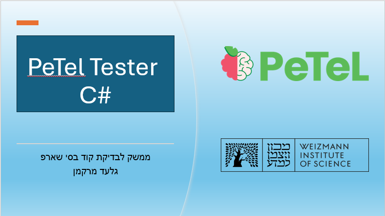
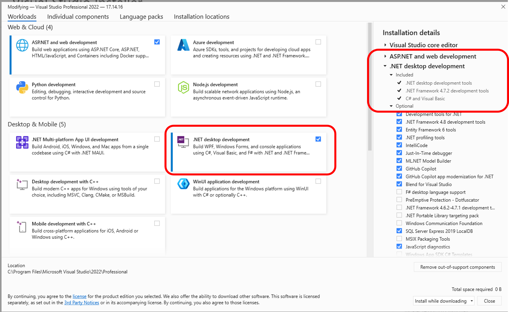
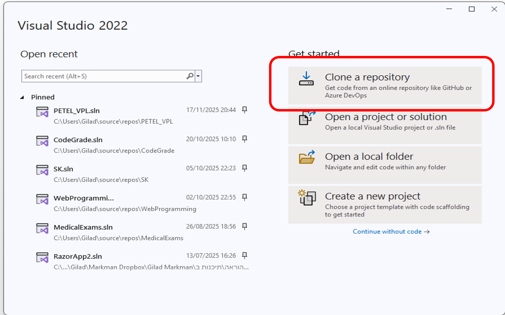
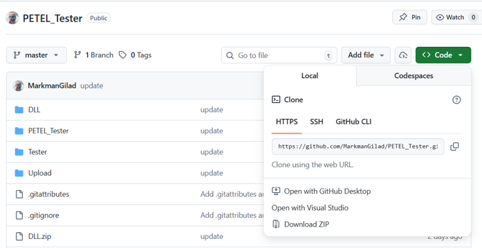
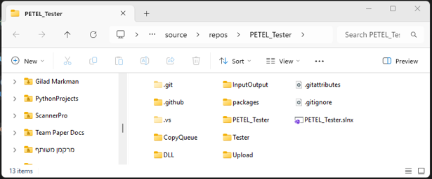
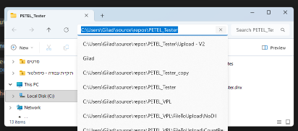
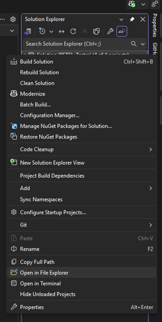

<p align="center">
      
</p>


# ממשק לבדיקת קוד - PeTel Tester C# (V2)

**מכון ויצמן למדע | PeTel**

מדריך זה מסביר כיצד להשתמש בממשק בדיקת הקוד (Tester) בשפת C# המיועד עבור סביבת **PeTel** (המבוססת על Moodle VPL). הממשק מאפשר למורים ליצור מטלות תכנות, להריץ בדיקות פונקציונליות (Case Tests) ובדיקות מבניות (Code Tests) על פתרונות תלמידים בצורה אוטומטית.

**גרסה זו מתארת את V2.** קוד ה-V2 נמצא בתיקיות:
- `PETEL_MainTester_V2`
- `PETEL_Runner_V2`
- `PETEL_V2_Core`
- `Upload_V2_Net472`

שאר התיקיות בפרויקט מיועדות ל-V1 (לא רלוונטיות למדריך זה).

## תוכן עניינים
1. [כללי](#כללי)
2. [הכנת סביבת הפיתוח](#הכנת-סביבת-הפיתוח)
3. [הורדת והתקנת הממשק](#הורדת-והתקנת-הממשק)
4. [יצירת משימה חדשה](#יצירת-משימה-חדשה)
5. [בניית Tester - קבצי בסיס](#בניית-tester---קבצי-בסיס)
6. [עבודה עם Unit4Helper](#עבודה-עם-unit4helper)
7. [בניית בדיקות פונקציונליות (Case Tester)](#בניית-בדיקות-פונקציונליות-case-tester)
8. [בניית בדיקות מבנה ותחביר (Code Tester)](#בניית-בדיקות-מבנה-ותחביר-code-tester)
9. [העלאת הבדיקה ל-PeTel VPL](#העלאת-הבדיקה-ל-petel-vpl)

---

## כללי

ממשק בדיקת הקוד (V2) מורכב משני סוגי בדיקות עיקריים:
1. **בדיקה פונקציונאלית (Case Tests)**: בדיקה של תוצאות הרצת קוד התלמיד (Return Value / פלט למסך / Side Effects בפרמטרים) בהשוואה לפתרון המורה.
2. **בדיקה תחבירית/מבנית (Code Tests)**: בדיקות על מבנה הקוד (למשל: האם קיימת רקורסיה? כמה לולאות יש? האם החתימה תואמת?).

ב-V2, כל **בדיקה פונקציונאלית** רצה בתהליך נפרד (Runner) כדי למנוע מצב שבו קריסה/תקיעה של פתרון תלמיד תפיל את כל הבדיקה.

תהליך העבודה כולל פיתוח הבדיקות בסביבת **Visual Studio**, הרצת בדיקות מקומיות על פתרונות אפשריים, ולבסוף העלאת הקבצים לסביבת PeTel.

---
---
## הכנת סביבת הפיתוח

סביבת הפיתוח הנדרשת היא **Visual Studio** (גרסת Community החינמית מספיקה).

### שלבי התקנה ודרישות:
1. בעת התקנת Visual Studio, יש לוודא שה-Workload בשם **NET desktop development.** מסומן.
2. יש לוודא שרכיב **NET Framework 4.7.2.** מותקן (אם חסר, יש להתקינו דרך ה-Installer בלשונית Individual Components).

<p align="center">
   
</p>
---

## הורדת והתקנת הממשק

הממשק זמין כפרויקט פתוח ב-GitHub. ניתן להוריד אותו באחת משתי דרכים:

1. **Cloning**: שכפול הפרויקט באמצעות Git.
2. **Download ZIP**: הורדת קובץ ZIP ופתיחתו במחשב.

**כתובת המאגר:** `https://github.com/MarkmanGilad/PETEL_Tester`

**חשוב (V2):** יש לעבוד מהענף (branch) `Version2` ב-GitHub. הענף `master` מיועד לגרסת V1.

### אפשרות 1: Cloning דרך Visual Studio
במסך הפתיחה בחר ב-**Clone a repository**, הזן את הכתובת הנ"ל ולחץ על **Clone**.
<p align="center">

</p>

### אפשרות 2: הורדת ZIP
באתר GitHub, לחץ על כפתור **Code** ובחר **Download ZIP**. לאחר ההורדה, חלץ את הקבצים (Extract) ופתח את הקובץ `PETEL_Tester.slnx`.

<p align="center">

</p>
---

## יצירת משימה חדשה

ב-V2 **אין צורך ליצור פרויקט נפרד לכל משימה** ואין צורך להעתיק קבצי מערכת בין פרויקטים.

### עבודה מקומית (Visual Studio)
הפרויקט כבר מכיל פרויקט ריצה מוכן:
- `PETEL_MainTester_V2` (מריץ את כל הטסטים ומחשב ציון)
- `PETEL_Runner_V2` (מריץ כל Case Test בתהליך נפרד)

כדי לפתח משימה חדשה מקומית:
1. קבע כ-Startup Project את `PETEL_MainTester_V2`.
2. ערוך את שני הקבצים של המשימה:
    - `TeacherAnswer.cs` — פתרון מורה.
    - `TestCases.cs` — הגדרות + בדיקות.
3. (אופציונלי) ערוך `StudentAnswer.cs` כדי לדמות תשובת תלמיד ולוודא שהבדיקות “תופסות” טעויות.

### ניהול כמה משימות באותו Solution (אופציונלי)
אם רוצים לשמור כמה סטים של בדיקות במחשב:
1. העתק את `TestCases.cs` לקובץ חדש (למשל `TestCases_CopyStack.cs`).
2. שנה גם את שם המחלקה (למשל `public static class TestCases_CopyStack`).
3. עדכן את `TestCasesTypeName` בקובץ `PETEL_MainTester_V2/Program.cs` כך שיצביע למחלקה החדשה (לדוגמה: `PETEL_VPL.TestCases_CopyStack`).

ב-PeTel/VPL **מומלץ** להעלות קובץ `TestCases.cs` שמכיל מחלקה בשם `PETEL_VPL.TestCases` (זהו ברירת המחדל שהטסטר מחפש).

עם זאת, **לא חובה** שהמחלקה תיקרא דווקא `TestCases`: כל שם מחלקה יעבוד, כל עוד התוכנית הראשית של הטסטר מוגדרת לחפש את אותו שם (לדוגמה ע"י שינוי `TestCasesTypeName` ב-`PETEL_MainTester_V2/Program.cs` ובנייה/העלאה של גרסת טסטר תואמת).

---
---

## בניית Tester - קבצי בסיס

תהליך בניית הבדיקה ב-V2 דורש עריכה של שני קבצים עיקריים (ועוד אחד אופציונלי להרצה מקומית):

1. **TeacherAnswer.cs**: קובץ המכיל את הפתרון הנכון (של המורה). משמש כבסיס להשוואה ("האמת").
2. **TestCases.cs**: קובץ שמכיל:
    - פונקציה `CreateTester()` שמגדירה איזה מחלקות/מתודות להשוות.
    - פונקציות בדיקה `Case_...` (פונקציונאליות) ו-`Code_...` (מבנה/תחביר).
3. **StudentAnswer.cs** (אופציונלי): קובץ המדמה פתרון של תלמיד להרצה מקומית בלבד.

יש לכתוב את פתרון המורה והתלמיד. פתרון התלמיד יכול לכלול שגיאות לצורך בדיקת ה Tetser. 

ניקח לדוגמה את השאלה בה נדרש התלמיד לבנות פעולה המעתיקה תור מבלי לפגוע בתור המקורי. תשובת התלמיד שגויה בכך שהיא משנה את התור המקורי.

<p align="center">
   
      
</p>

---

## עבודה עם Unit4Helper

הממשק כולל מחלקה בשם `Unit4Helper` המאפשרת יצירה והדפסה קלה של מבני נתונים (רשימות, תורים, מחסניות ועצים) לצורך כתיבת הבדיקות.

### פעולות עבור רשימת חוליות
```csharp
public static void NodeLIst()
{
    Node<int> lst = Unit4Helper.BuildNodeList(new int[] { 4, -2, 7, 0, -1, 0, 0 });
    Unit4Helper.PrintList(lst);
    int[] arr = Unit4Helper.NodeListToArray(lst);
    string str = Unit4Helper.NodeListToString(lst);
    Console.WriteLine(str);
}
```

### פעולות של תור
```csharp
public static void QueueMethods()
{
    Queue<int> q = Unit4Helper.BuildQueue(new int[] { 4, -2, 7, 0, -1, 0, 0 });
    Console.WriteLine(q);
    int[] arr = Unit4Helper.QueueToArray(q);
}
```

### פעולות של מחסנית
```csharp
public static void StackMethods() 
{
    Stack<int> s = Unit4Helper.BuildStack(new int[] { 4, -2, 7, 0, -1, 0, 0 });
    Console.WriteLine(s);
    int[] arr = Unit4Helper.StackToArray(s);
}
```


### עצים בינאריים
**עצים בינאריים:** ניתן לטעון עץ מקובץ טקסט המייצג את המבנה בהזחות (Tabs)


  ```csharp
public static void BinTreeMethods()
{
    string path = Unit4Helper.GetTreeFilePath("tree.txt");
    BinNode<int> tree = Unit4Helper.BuildBinaryTree<int>(path);
    Unit4Helper.PrintBinaryTree(tree);
    Unit4Helper.PrintBinaryTreeColored(tree);
    string str = Unit4Helper.BinaryTreeToString(tree);
    Console.WriteLine(str);
}
  ```

<p align="center">
   
   
   
</p>

---

## בניית בדיקות פונקציונליות (Case Tester)

ב-V2, הבדיקות מוגדרות כמתודות סטטיות בתוך `TestCases.cs`.

### הגדרות משימה (CreateTester)
במחלקת ה-TestCases שהטסטר מריץ (ברירת מחדל: `PETEL_VPL.TestCases`) חייבת להיות מתודה בשם `CreateTester` שמחזירה `VPLTester`. מתודה זו מגדירה **איזו פעולה של התלמיד** בודקים, **מול איזו פעולת מורה**, ובאילו שמות קבצים/מחלקות/מרחבי שמות להשתמש.

```csharp
public static VPLTester CreateTester()
{
    // ההגדרה המינימלית: שם המתודה של התלמיד (ובברירת מחדל גם של המורה)
    return new VPLTester(studentMethodName: "CountValues");
}
```

#### אפשרויות נוספות להגדרה ב-CreateTester (V2)
ל-`VPLTester` יש בנאי עם הפרמטרים הבאים (החשובים להגדרת משימה):

```csharp
public static VPLTester CreateTester()
{
    var tester = new VPLTester(
        studentMethodName: "CountValues",
        teacherMethodName: "CountValues",     // אופציונלי: אם שם מתודת המורה שונה
        studentFile: "StudentAnswer.cs",      // ברירת מחדל
        studentNamespace: "",                 // ברירת מחדל
        studentClassName: "StudentAnswer",    // ברירת מחדל
        teacherNamespace: "",                 // ברירת מחדל
        teacherClassName: "TeacherAnswer",    // ברירת מחדל
        timeoutMilliseconds: 500               // זמן מקס' לכל Case_... (Runner)
    );

    // ShowDetails = true מציג יותר פירוט (מומלץ לפיתוח מקומי).
    // ב-PeTel/VPL לרוב עדיף להשאיר false כדי לא להציף פלט.
    tester.ShowDetails = false;

    return tester;
}
```

**פירוט הפרמטרים:**

| פרמטר | תיאור | מתי צריך לשנות? |
| :--- | :--- | :--- |
| `studentMethodName` | שם המתודה של התלמיד שנבדקת. | תמיד בהתאם לדרישת המטלה. |
| `teacherMethodName` | שם המתודה של המורה להשוואה. אם לא מוגדר — ברירת המחדל היא אותו שם כמו `studentMethodName`. | אם רוצים להשוות מול מתודה בשם שונה במורה, או לבדוק מספר מתודות שונות. |
| `studentFile` | שם קובץ התלמיד. ב-VPL בדרך כלל `StudentAnswer.cs`. | אם דרשתם מהתלמיד שם קובץ אחר. |
| `studentNamespace` | מרחב השמות של מחלקת התלמיד. ברירת מחדל ריק. | אם התלמיד נדרש להכניס `namespace`. |
| `studentClassName` | שם מחלקת התלמיד. ברירת מחדל `StudentAnswer`. | אם הדרישה היא מחלקה בשם אחר. |
| `teacherNamespace` | מרחב השמות של מחלקת המורה. ברירת מחדל ריק. | אם פתרון המורה נמצא בתוך `namespace`. |
| `teacherClassName` | שם מחלקת המורה. ברירת מחדל `TeacherAnswer`. | אם פתרון המורה הוא במחלקה בשם אחר. |
| `timeoutMilliseconds` | זמן מקסימלי להרצת **כל Case_...** בתהליך ה-Runner (למניעת תקיעות). | אם רוצים להאריך/לקצר זמן למטלות כבדות/קלות. |

**מאפיין נוסף חשוב:**

| מאפיין | תיאור | הערה |
| :--- | :--- | :--- |
| `ShowDetails` | אם `true` — המערכת תנסה להדפיס פירוט רחב יותר על ההשוואות/כשלונות. | טוב לדיבוג מקומי; ב-VPL עדיף לרוב `false`. |

בנוסף, אפשר לשנות את אותם ערכים גם דרך מאפיינים (Properties) של `tester` בתוך הטסטים (למשל שינוי זמני של `tester.StudentMethodName` לבדיקת כמה מתודות, ואז החזרה לערך המקורי).

### כתיבת בדיקות (Case_...)
כל בדיקה פונקציונלית היא מתודה סטטית בשם `Case_...` עם חתימה:

```csharp
public static void Case_1_SomeTest(VPLTester tester)
{
    tester.TestMethod(...);
}
```

כל `Case_...` ירוץ בתהליך נפרד (Runner).

### הגדרת בדיקה (TestMethod)
הפונקציה `tester.TestMethod` מגדירה מקרה בדיקה בודד. להלן הפרמטרים העיקריים:

| פרמטר | סוג | תיאור |
| :--- | :--- | :--- |
| **testName** | `string` | שם הבדיקה והסבר קצר שיוצג לתלמיד. |
| **points** | `int` | ניקוד שיינתן במידה והבדיקה עברה. |
| **parameters** | `object[]` | מערך הפרמטרים שיישלחו לפונקציה הנבדקת. |
| **consoleInput** | `object` | קלט למסוף. נתמך: `string` (שורה אחת) או `string[]` / `List<string>` (כמה שורות). המערכת מוסיפה ירידות שורה אוטומטית. |
| **captureConsoleOutput** | `bool` | האם להשוות את הפלט שהודפס למסוף (Console.WriteLine)? (ברירת מחדל: `false`). |
| **compareParams** | `bool` | האם לבדוק שינויים בפרמטרים המקוריים (Side Effects)? (ברירת מחדל: `true`). |
| **exceptionComments** | `Dictionary<Type, string>` | מילון הממיר שגיאות (Exceptions) להודעות מותאמות אישית. |
| **compareReturn** | `bool` | האם לבדוק את ערך ההחזרה? (ברירת מחדל: `true`). |

#### דוגמה לתרגיל:

כתוב פעולה המקבלת מספר שלם num. הפעולה תקלוט מחירים של מוצרים כמספר ה num. הפעולה תדפיס את סכום המוצרים ותחזיר את הממוצע שלהם.

**בדיקות**
```csharp
public static void Case_1_Average_3Numbers(VPLTester tester)
{
    tester.TestMethod(
        testName: "Test 1: 3 numbers. capture Console Output",
        points: 10,
        parameters: new object[] { 3 },
        compareParams: false,
        consoleInput: new string[] { "5", "3", "7" },
        captureConsoleOutput: true
    );

    tester.TestMethod(
        testName: "Test 2: 3 numbers. Only Compare Return",
        points: 10,
        parameters: new object[] { 3 },
        compareParams: false,
        consoleInput: new string[] { "5", "3", "4" },
        captureConsoleOutput: false
    );

    tester.TestMethod(
        testName: "Test 3: 1 numbers",
        points: 10,
        parameters: new object[] { 1 },
        compareParams: false,
        consoleInput: "3",
        captureConsoleOutput: true,
        compareReturn: false
    );
}
```

### בדיקה של כמה מתודות באותו TestCases
אפשר לבדוק כמה מתודות של התלמיד באותו קובץ בדיקות, ע"י שינוי זמני של `tester.StudentMethodName` (ולהחזיר בסוף לערך המקורי):

```csharp
public static void Case_ExtraFunction(VPLTester tester)
{
    var original = tester.StudentMethodName;
    tester.StudentMethodName = "OtherMethodName";

    tester.TestMethod(
        testName: "Other method test",
        points: 10,
        parameters: new object[] { /* ... */ }
    );

    tester.StudentMethodName = original;
}
```

<p align="center">
   
</p>

---

#### דוגמה לתרגיל נוסף:
כתבו פעולה המעתיקה תור מבלי לפגוע בתור המקורי.
* בדיקה ראשונה – בודק רק את התור המוחזר ולא בודק אם התור המקורי השתנה.
* בדיקה שניה – בודק רק אם התור המקורי השתנה.
* בדיקה שלישית – בודק את שניהם
```csharp
public static void Case_1_CopyQueue(VPLTester tester)
{
    Queue<int> q1 = Unit4Helper.BuildQueue(new int[] { 3, 5, -9, 3, 5, 5, 2, 1, 2 });
    tester.TestMethod(
        testName: "Test 1: check the correct return. Don't check the original Queue ",
        points: 10,
        parameters: new object[] { q1 },
        compareParams: false
    );


    Queue<int> q2 = Unit4Helper.BuildQueue(new int[] { 3, 5, -9, 3, 5, 5, 2, 1, 2 });
    tester.TestMethod(
        testName: "Test 2: check only the original Queue if it changed",
        points: 10,
        parameters: new object[] { q2 },
        compareParams: true, 
        compareReturn:false
    );

    q2 = Unit4Helper.BuildQueue(new int[] { 3, 5, -9, 3, 5, 5, 2, 1, 2 });
    tester.TestMethod(
        testName: "Test 2: check both return and original",
        points: 10,
        parameters: new object[] { q2 },
        compareParams: true,
        compareReturn: true
    );
}

```

### הוספת הודעת שגיאה מותאמת אישית

ב-V2 קיימים **שני סוגים** של הודעות שגיאה מותאמות אישית:

1. **הודעות שגיאה רגילות (Exceptions מנוהלים)** — באמצעות `exceptionComments` בתוך `tester.TestMethod(...)`.
2. **הודעות ריצה מיוחדות** עבור `timeout` (לולאה אינסופית/תקיעה) או `stack overflow` — באמצעות משתנים סטטיים ב-`TestCases` (מוסבר מיד).

> חשוב: במקרי `timeout`/`stack overflow` ייתכן שהתהליך של הבדיקה קרס/נתקע ולא הפיק פלט בכלל. לכן ההודעה שמוצגת לתלמיד מגיעה מהתהליך הראשי (MainTesterHost) ולא מתוך `exceptionComments`.

```csharp
 public static void Case_Exceptions_WithCustomMessage(VPLTester tester)
 {

     // Optional: Custom exception message
     var commonExceptionComments = new C.Dictionary<Type, string>
     {
         { typeof(NullReferenceException), "You tried to remove from empty queue" },
     };

     Queue<int> q1 = Unit4Helper.BuildQueue(new int[] { 3, 5, -9, 3, 5, 5, 2, 1, 2 });
     tester.TestMethod(
         testName: "Test 1: check the correct return. Don't check the original Queue ",
         points: 10,
         parameters: new object[] { q1 },
         compareParams: false,
         exceptionComments: commonExceptionComments
     );
 }
```

### הודעות timeout / stack overflow (מיוחד ל-V2)

כדי להציג הודעה מותאמת במקרה של `timeout` או `stack overflow`, יש להגדיר ב-`TestCases.cs` שני משתנים סטטיים (בדומה למה שמופיע בדוגמה `TestCases1`):

```csharp
public static class TestCases
{
    public static string TimeoutComment =
        "Runtime error: timeout (possible infinite loop).";

    public static string StackOverflowComment =
        "Runtime error: stack overflow.";

    // ... CreateTester + tests ...
}
```

אלו ההודעות שמערכת V2 תציג כאשר בדיקת `Case_...` לא הסתיימה בזמן או כאשר תהליך הריצה קרס מ-StackOverflow.

* לדוגמה הודעת השגיאה המקורית:
<p align="center">
   
</p>

* לאחר השינוי הוספה ההודעה הבאה:
<p align="center">
   
</p>

---
---

## בניית בדיקות מבנה ותחביר (Code Tester)

במערכת PeTel ניתן לבדוק דרישות פדגוגיות ומבניות בקוד התלמיד באמצעות `CodeAnalyzer`.

ב-V2, בדיקות מבנה מוגדרות כמתודות סטטיות בשם `Code_...` בתוך `TestCases.cs`, ומשתמשים בפונקציה `TestCodeStructure`.
* נוסיף את שם הבדיקה והסבר.
* מספר הנקודות.
* סוג הבדיקה לפי רשימה קבועה מראש (ראו במהשך).
* פרמטרים נוספים אופציונאליים: כגון הודעת שגיאה.

**לדוגמה:**
```csharp
public static void Code_1_CheckSignature(VPLTester tester)
{
    // NEW: Check student method parameter list matches teacher method
    tester.TestCodeStructure(
        testName: "Test Params: method signature matches teacher",
        points: 5,
        checkType: CodeStructureCheck.CheckParams,
        shouldPass: true,
        failureMessage: "Wrong parameter list. Ensure the method has the same parameters as the teacher (name, count, and types)."
    );

    // NEW: Check return type matches teacher method
    tester.TestCodeStructure(
        testName: "Test Return Type: matches teacher",
        points: 5,
        checkType: CodeStructureCheck.CheckReturnType,
        shouldPass: true,
        failureMessage: "Wrong return type. Ensure the method returns the same type as the teacher."
    );

    // Test 11: Check that the method uses exactly one loop (O(n) complexity)
    tester.TestCodeStructure(
        testName: "Test 11: Uses exactly one loop",
        points: 10,
        checkType: CodeStructureCheck.CountAnyLoop,
        expectedCount: 1,
        failureMessage: "Method must use exactly one loop for O(n) time complexity"
    );
}
```

---
### פרמטרים של TestCodeStructure:


| פרמטר | סוג (Type) | פירוט והסבר | חובה/אופציונלי |
| :--- | :--- | :--- | :--- |
| **testName** | `String` | שם הבדיקה והסבר קצר שלה. הטקסט יופיע לתלמיד. | חובה |
| **points** | `Int` | מספר הנקודות שיקבל התלמיד אם יעבור את הבדיקה. | חובה |
| **checkType** | `CodeStructureCheck` | סוג הבדיקה לפי רשימה קבועה מראש (כגון `IsRecursive`, `HasNestedLoops` וכו'). | חובה |
| **shouldPass** | `Bool` | האם תוצאת הבדיקה המצופה היא חיובית או שלילית (ברירת מחדל: `true`). | אופציונלי |
| **expectedCount** | `Int?` | בבדיקות כמותיות: המספר המצופה (לדוגמה: מספר הלולאות). ברירת מחדל: `null`. | אופציונלי |
| **failureMessage** | `String` | הודעת שגיאה שתוצג לתלמיד אם הבדיקה נכשלת. ברירת מחדל: `null`. | אופציונלי |

---

### סוגי בדיקות (CodeStructureCheck)
להלן רשימה של הבדיקות האפשריות:

| שם הבדיקה (Check Name) | ערך מוחזר (Return Type) | תיאור הבדיקה |
| :--- | :--- | :--- |
| **IsRecursive** | `bool` | האם קיימת קריאה רקורסיבית בפעולה. |
| **CountForLoop** | `Int` | מספר לולאות `for` (לאו דווקא מקוננות) בהן השתמש התלמיד. |
| **CountWhileLoop** | `Int` | מספר לולאות `while` (לאו דווקא מקוננות) בהן השתמש התלמיד. |
| **CountForEachLoop** | `Int` | מספר לולאות `forEach` (לאו דווקא מקוננות) בהן השתמש התלמיד. |
| **CountAnyLoop** | `Int` | מספר לולאות מכל סוג בהן השתמש התלמיד (לאו דווקא מקוננות). |
| **CountIfStatements** | `Int` | מספר משפטי התנאי (`if`) בהם השתמש התלמיד. |
| **CountRecursiveCalls** | `Int` | מספר הקריאות הרקורסיביות בפעולה. |
| **CountReturnStatements** | `Int` | מספר פקודות ה-`return` בפעולה. |
| **CountNewNodes** | `Int` | מספר הפקודות `new Node<T>` בפעולה. |
| **CountNewQueue** | `Int` | מספר הפקודות `new Queue<T>` בפעולה. |
| **CountNewStack** | `Int` | מספר הפקודות `new Stack<T>` בפעולה. |
| **CountNewBinNode** | `Int` | מספר הפקודות `new BinNode<T>` בפעולה. |
| **CountSetNext** | `Int` | מספר פקודות `SetNext` של המחלקה `Node<T>`. |
| **CountGetNext** | `Int` | מספר פקודות `GetNext` של המחלקה `Node<T>`. |
| **HasNestedLoops** | `Bool` | האם התלמיד השתמש בלולאות מקוננות מכל סוג (משמש לבדיקת סיבוכיות). |
| **IsStatic** | `Bool` | בדיקת חתימת הפעולה (האם מוגדרת כ-Static). |
| **IsPublic** | `Bool` | בדיקת חתימת הפעולה (האם מוגדרת כ-Public). |
| **IsPrivate** | `Bool` | בדיקת חתימת הפעולה (האם מוגדרת כ-Private). |
| **IsProtected** | `Bool` | בדיקת חתימת הפעולה (האם מוגדרת כ-Protected). |
| **IsInternal** | `Bool` | בדיקת חתימת הפעולה (האם מוגדרת כ-Internal). |
| **CheckParams** | `Bool` | בדיקת חתימת הפעולה – השוואת הפרמטרים לחתימת פעולת המורה. |
| **CheckReturnType** | `Bool` | בדיקת חתימת הפעולה – השוואת הערך המוחזר לחתימת פעולת המורה. |

---


#### דוגמה לבדיקת יעילות (O(n)) ומניעת לולאות מקוננות:
```csharp
tester.TestCodeStructure(
    testName: "Test 11: No nested loops (O(n) complexity)",
    points: 10,
    checkType: CodeStructureCheck.HasNestedLoops,
    shouldPass: false, // אנו מצפים שהתוצאה תהיה False (אין לולאות מקוננות)
    failureMessage: "Method must not have nested loops"
);
```

---
<p align="center">
   
</p>

## העלאת הבדיקה ל-PeTel VPL

לאחר שהבדיקות עובדות מקומית ב-Visual Studio, יש ליצור שאלה מתאימה ולהעלות את קבצי הבדיקה לסביבת PeTel (Moodle).

### שלב 1: יצירת שאלה
1. בתוך Moodle/PeTel, צור פעילות חדשה מסוג **VPL Question**.
2. הגדר את שם הקובץ הנדרש מהתלמיד (למשל `StudentAnswer.cs`).
<p align="center">
   
</p>

3. ב"תבנית תשובה" (Answer Template), הדבק את שלד הקוד של `StudentAnswer` ומחק את הקטעים הרלוונטיים.

<p align="center">
   
   
</p>


### שלב 2: העלאת קבצי הבדיקה (Upload)
יש להעלות ל-VPL שני סוגי קבצים דרך מסך הקבצים של שאלה מסוג VPL:

ללחוץ על פלוס (+)

<p align="center">
   
</p>

ללחוץ על חץ למעלה (&uarr;) 
<p align="center">
   
</p>


#### א. קבצי מערכת כלליים (Common Files)
ב-V2 קבצים אלו זהים לכל המשימות ונמצאים בתיקייה `Upload_V2_Net472`. יש להעלות את:
* `tester_payload.tar` (מכיל את קבצי המערכת של ה-Tester: Runner + Core + תלות)
* `vpl_evaluate.sh`
* `vpl_run.sh`

  
יש לאתר את הספריה `Upload_V2_Net472` בתוך הפרויקט שלכם, לסמן את שלושת הקבצים שבתוכה, ולהעלות אותם (עזרה באיתור הספריה ראה בהמשך). קבצים אילו קבועים בכל המשימות.

<p align="center">
   
</p>

**איתור ספריית Upload_V2_Net472**: על מנת לאתר את ספריית העבודה במחשב שלנו נלחץ קליק ימני על ה solution שלנו. בחירה ב Open in File Explorer. ניתן להעתיק את הנתיב של הפרויקט ולהשתמש בו בחלון העלאה של ה PETEL.

<p align="center">

|  |  |
|---|---|
| <br> |  |

</p>


#### ב. קבצי המשימה הספציפית

בשלב הבא נעלה את הקבצים של המשימה הספציפית (המורה). **יש להעלות בדיוק 3 קבצים**:
* `TeacherAnswer.cs`
* `TestCases.cs` (או קובץ בשם אחר שמכיל את מחלקת ה-TestCases שלכם)
* `Program.cs` (התוכנית הראשית של הטסטר)

ב-`Program.cs` נקבע שם המחלקה של ה-TestCases שהטסטר יריץ (באמצעות הקבוע `TestCasesTypeName`, לדוגמה: `PETEL_VPL.TestCases`).

בזמן פיתוח מקומי בדרך כלל עובדים עליהם מתוך הפרויקט `PETEL_MainTester_V2`.

לפני העלאה ל-PeTel/VPL, מעלים לשאלה את קבצי המשימה אחרי שהתאמתם אותם (אפשר פשוט להעתיק את שלושת הקבצים לתיקייה `Upload_V2_Net472` כדי שיהיה קל לאתר אותם בעת ההעלאה).

**הערה:** שמות הקבצים עצמם לא חייבים להיות דווקא `TeacherAnswer.cs`/`TestCases.cs`/`Program.cs` (VPL מקמפל את כל קבצי ה-`.cs` שנמצאים בשאלה). אם שיניתם שמות קבצים/מחלקות/מרחבי שמות — יש לעדכן את ההגדרות בקוד בהתאם (בעיקר `CreateTester()` ובמידת הצורך גם `TestCasesTypeName` ב-`Program.cs`).

**שים לב:** אין להעלות את `StudentAnswer.cs` (זהו קובץ שהתלמיד מגיש) ואין להעלות קבצים נוספים שלא צוינו.

**הערה על תקלות ריצה:** אם תהליך הבדיקה של תלמיד קורס (למשל StackOverflow) ייתכן שלא יופיע פלט מפורט מהתהליך שקרס. במצב כזה תהליך האב עדיין מחכה ל-timeout ורק אז מחזיר הודעת ריצה קצרה (לפי `TimeoutComment`/`StackOverflowComment` המוגדרים ב-`TestCases.cs`).

**העלאת הקבצים**

<p align="center">
   
</p>

### שלב 3: אימות (Verification)
1. לחץ על שמירה.
2. עבור ללשונית "תצוגה מקדימה" (Preview).
<p align="center">
   
</p>
   
4. הדבק פתרון תקין (או שגוי) בחלון העורך ולחץ על **בדיקה** (Check).
5. וודא שהפלט המתקבל זהה לפלט שראית ב-Visual Studio.

<p align="center">
   
   
</p>


---

<p align="center">
   
</p>

